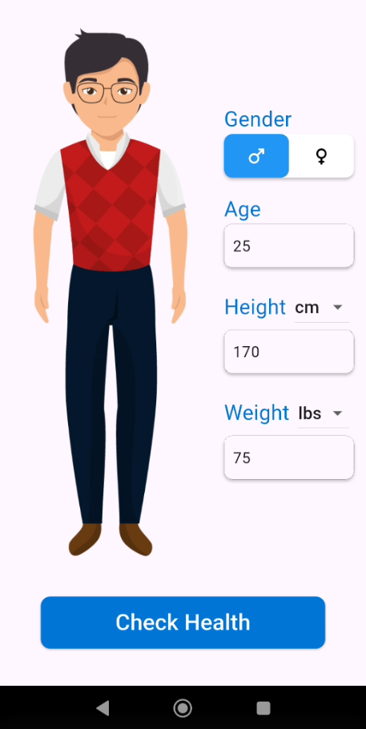
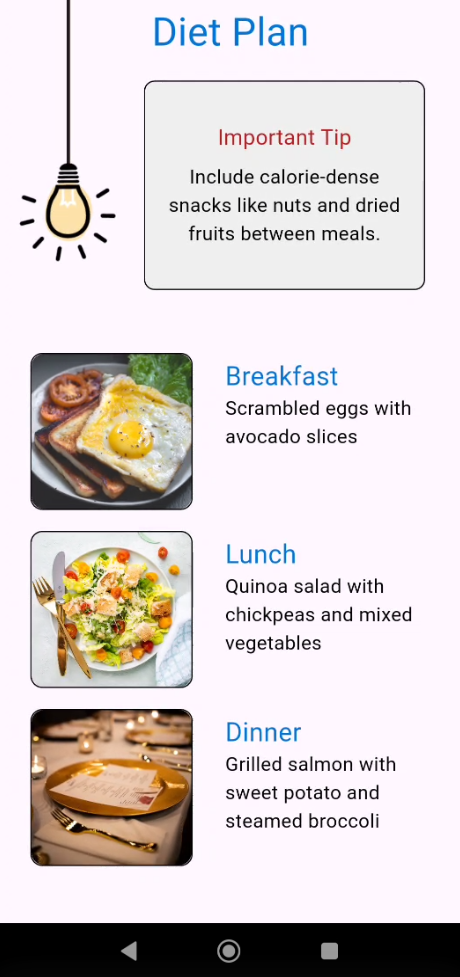
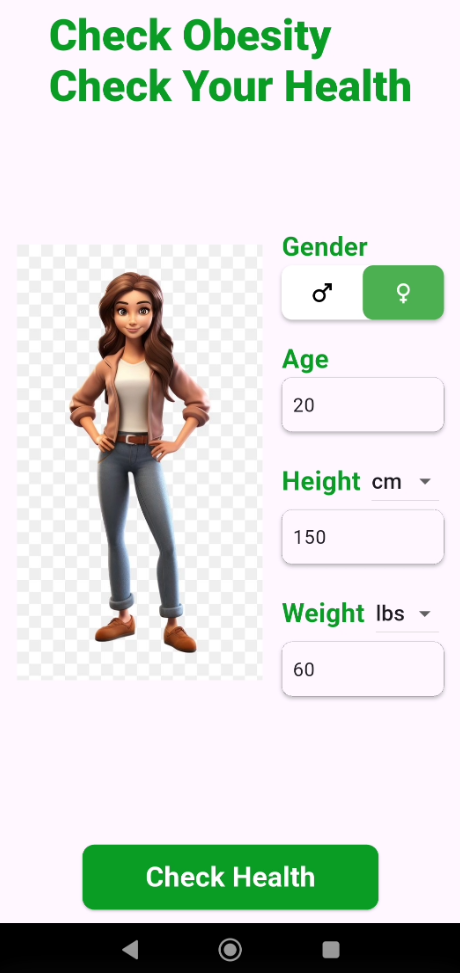
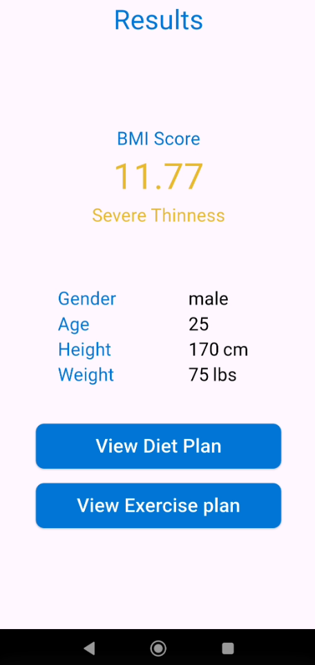
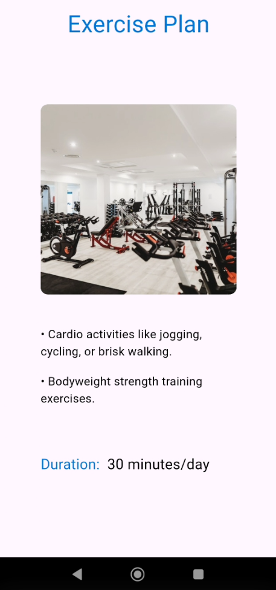

# HealthyHub BMI Calculator

HealthyHub is a cross-platform application built with Flutter to help users track their health by calculating their Body Mass Index (BMI). Based on user inputs like age, gender, height, and weight, the app provides a comprehensive health analysis, including personalized diet and exercise plans.

## Features

- **BMI Calculation:** Accurately calculates BMI using standard formulas, with support for both metric (cm/kg) and imperial (ft.in/lbs) units.
- **Personalized Results:** Displays the BMI score along with a clear, color-coded health status (e.g., Underweight, Normal, Overweight, Obese).
- **Custom Diet Plans:** Generates tailored diet suggestions for breakfast, lunch, and dinner based on the user's BMI category.
- **Suggested Exercise Routines:** Provides age and BMI-appropriate exercise recommendations, including activity types and suggested duration.
- **Dynamic UI:** Features an interactive interface that visually adapts to user input for gender and age.
- **Onboarding:** A welcoming onboarding experience for new users, with preferences saved locally for a streamlined experience on future launches.
- **Cross-Platform:** Developed using Flutter, ensuring a consistent user experience across Android, iOS, web, and desktop platforms.

## 🎥 Demo
<p align="left">
  
  
  
  
  
</p>


## Application Flow

1.  **Splash & Onboarding:** The app starts with a splash screen, followed by a one-time onboarding screen that introduces the features of HealthyHub.
2.  **Home Screen:** Users enter their details: gender, age, height, and weight. The interface provides options for different units and updates dynamically.
3.  **Results Screen:** After submitting the data, the app displays the calculated BMI score, classifies the result (e.g., "Normal", "Over Weight"), and summarizes the user's data.
4.  **Diet Plan:** Users can navigate to a dedicated screen that outlines a sample diet plan with meal ideas and an important tip relevant to their BMI status.
5.  **Exercise Plan:** A separate screen suggests exercises and a recommended duration tailored to the user's age and BMI.

## Getting Started

To get a local copy up and running, follow these simple steps.

### Prerequisites

Ensure you have the Flutter SDK installed on your machine. For more information, see the [Flutter documentation](https://flutter.dev/docs/get-started/install).

### Installation & Setup

1.  Clone the repository:
    ```sh
    git clone https://github.com/AhmedAljamal15/Check-Obsity.git
    ```
2.  Navigate to the project directory:
    ```sh
    cd Check-Obsity
    ```
3.  Install the required dependencies:
    ```sh
    flutter pub get
    ```

### Running the Application

1.  Connect a device or start an emulator.
2.  Run the application:
    ```sh
    flutter run
